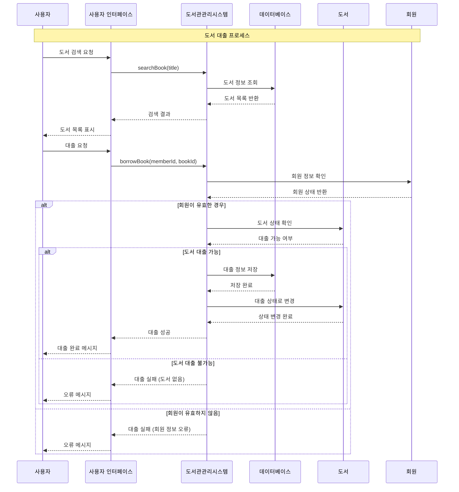

# 도서관 관리 시스템 (Library Management System)

## 프로젝트 개요

일상 속 소프트웨어 사용 사례인 **도서관 관리 시스템**을 시퀀스 다이어그램으로 모델링하고, 이를 기반으로 Python으로 구현한 프로젝트입니다.

## 📋 목차

- [시퀀스 다이어그램](#시퀀스-다이어그램)
- [시스템 구조](#시스템-구조)
- [주요 기능](#주요-기능)
- [실행 방법](#실행-방법)
- [모듈 평가](#모듈-평가)
- [파일 구조](#파일-구조)

## 🔄 시퀀스 다이어그램

### 도서 대출 및 반납 프로세스



## 🏗️ 시스템 구조

### 클래스 다이어그램

```
┌─────────────────┐    ┌─────────────────┐
│      Book       │    │     Member      │
├─────────────────┤    ├─────────────────┤
│ - book_id       │    │ - member_id     │
│ - title         │    │ - name          │
│ - author        │    │ - email         │
│ - is_available  │    │ - borrowed_books│
├─────────────────┤    ├─────────────────┤
│ + borrow()      │    │ + can_borrow()  │
│ + return_book() │    │ + add_borrowed  │
└─────────────────┘    └─────────────────┘
         │                       │
         └───────┐       ┌───────┘
                 │       │
         ┌─────────────────┐
         │    Database     │
         ├─────────────────┤
         │ - books         │
         │ - members       │
         │ - borrow_records│
         ├─────────────────┤
         │ + add_book()    │
         │ + get_book()    │
         │ + search_books()│
         └─────────────────┘
                 │
         ┌─────────────────┐
         │LibraryManagement│
         │     System      │
         ├─────────────────┤
         │ - database      │
         ├─────────────────┤
         │ + search_book() │
         │ + borrow_book() │
         │ + return_book() │
         └─────────────────┘
                 │
         ┌─────────────────┐
         │ UserInterface   │
         ├─────────────────┤
         │ - library_system│
         ├─────────────────┤
         │ + display_*()   │
         │ + *_interface() │
         └─────────────────┘
```

## ⚡ 주요 기능

### 1. 도서 관리
- ✅ 도서 검색 (제목 기반)
- ✅ 도서 정보 관리 (제목, 저자, ISBN)
- ✅ 도서 상태 관리 (대출 가능/불가능)

### 2. 회원 관리
- ✅ 회원 정보 관리
- ✅ 대출 한도 확인 (최대 5권)
- ✅ 회원 활성화 상태 관리

### 3. 대출/반납 시스템
- ✅ 도서 대출 처리
- ✅ 도서 반납 처리
- ✅ 대출 기록 관리
- ✅ 반납 예정일 계산 (14일)

### 4. 사용자 인터페이스
- ✅ 직관적인 콘솔 인터페이스
- ✅ 검색 결과 표시
- ✅ 성공/실패 메시지 표시

## 🚀 실행 방법

### 요구사항
- Python 3.7 이상

### 설치 및 실행
```bash
# 저장소 클론
git clone [저장소 URL]
cd library-management-system

# Python 파일 실행
python library_management_system.py
```

### 실행 결과 예시
```
=== 도서관 관리 시스템 테스트 ===

1. 도서 검색 테스트

=== 검색 결과 ===
ID: B001, 제목: 파이썬 프로그래밍, 저자: 김파이, 상태: 대출 가능

2. 도서 대출 테스트

도서 "파이썬 프로그래밍"이 성공적으로 대출되었습니다.
반납 예정일: 2025-06-08T15:30:00.123456

3. 중복 대출 시도

이미 대출된 도서입니다.

4. 도서 반납 테스트

도서 "파이썬 프로그래밍"이 성공적으로 반납되었습니다.

5. 반납 후 도서 상태 확인

=== 검색 결과 ===
ID: B001, 제목: 파이썬 프로그래밍, 저자: 김파이, 상태: 대출 가능
```

## 📊 모듈 평가

### 응집도 (Cohesion) 분석

| 클래스 | 응집도 수준 | 평가 | 설명 |
|--------|-------------|------|------|
| **Book** | 기능적 응집도 | ⭐⭐⭐⭐⭐ | 도서 관련 기능만 집중 |
| **Member** | 기능적 응집도 | ⭐⭐⭐⭐⭐ | 회원 관련 기능만 집중 |
| **Database** | 기능적 응집도 | ⭐⭐⭐⭐⭐ | 데이터 관리 기능만 집중 |
| **LibraryManagementSystem** | 순차적 응집도 | ⭐⭐⭐⭐ | 도서관 업무 프로세스 관리 |
| **UserInterface** | 기능적 응집도 | ⭐⭐⭐⭐⭐ | UI 관련 기능만 집중 |

### 결합도 (Coupling) 분석

| 관계 | 결합도 수준 | 평가 | 설명 |
|------|-------------|------|------|
| **Book ↔ 기타** | 데이터 결합도 | ⭐⭐⭐⭐⭐ | 완전히 독립적 |
| **Member ↔ 기타** | 데이터 결합도 | ⭐⭐⭐⭐⭐ | 완전히 독립적 |
| **Database ↔ Book/Member** | 스탬프 결합도 | ⭐⭐⭐⭐ | 객체 전달하지만 의존성 최소 |
| **LMS ↔ Database** | 객체 결합도 | ⭐⭐⭐ | 개선 여지 있음 (의존성 주입) |
| **UI ↔ LMS** | 데이터 결합도 | ⭐⭐⭐⭐ | 의존성 주입 사용 |

### 종합 평가
- **응집도**: 4.8/5.0 (우수)
- **결합도**: 4.2/5.0 (양호)
- **전체 품질**: 4.5/5.0 (우수)

### 설계 원칙 준수도
- ✅ **단일 책임 원칙 (SRP)**: 각 클래스가 하나의 책임만 가짐
- ✅ **개방-폐쇄 원칙 (OCP)**: 확장에는 열려있고 수정에는 닫혀있음
- ✅ **의존성 역전 원칙 (DIP)**: UserInterface에서 의존성 주입 사용
- ⚠️ **인터페이스 분리 원칙 (ISP)**: 개선 여지 있음

## 📁 파일 구조

```
library-management-system/
├── README.md                     # 프로젝트 설명
├── library_management_system.py  # 메인 소스 코드
├── sequence_diagram.mmd          # Mermaid 시퀀스 다이어그램
├── module_evaluation.md          # 모듈 평가 보고서
└── docs/                        # 문서 폴더
    ├── class_diagram.md         # 클래스 다이어그램
    └── test_results.md          # 테스트 결과
```

## 🔧 기술적 특징

### 객체지향 설계 패턴
- **단일 책임 원칙**: 각 클래스가 명확한 단일 책임
- **의존성 주입**: UserInterface에서 LibraryManagementSystem 주입
- **캡슐화**: 내부 데이터 보호 및 메서드를 통한 접근

### 코드 품질
- **타입 힌팅**: Python 3.7+ 타입 힌트 적극 활용
- **에러 처리**: 각 기능별 적절한 에러 메시지 제공
- **문서화**: 각 클래스와 메서드에 docstring 제공

### 확장성 고려사항
- **모듈화**: 각 기능이 독립적으로 분리
- **인터페이스 일관성**: 일관된 메서드 명명 규칙
- **데이터 변환**: 객체 ↔ 딕셔너리 변환 지원

## 🚀 향후 개선 계획

### 1. 아키텍처 개선
- [ ] 추상 클래스/인터페이스 도입
- [ ] 의존성 주입 컨테이너 구현
- [ ] 설정 파일 외부화

### 2. 기능 확장
- [ ] 도서 예약 시스템
- [ ] 연체료 계산
- [ ] 도서 카테고리 분류
- [ ] 사용자 권한 관리

### 3. 데이터 관리
- [ ] 실제 데이터베이스 연동 (SQLite/PostgreSQL)
- [ ] 데이터 영속성 보장
- [ ] 백업/복구 기능

### 4. 사용자 경험
- [ ] GUI 인터페이스 (Tkinter/PyQt)
- [ ] 웹 인터페이스 (Flask/Django)
- [ ] REST API 제공
